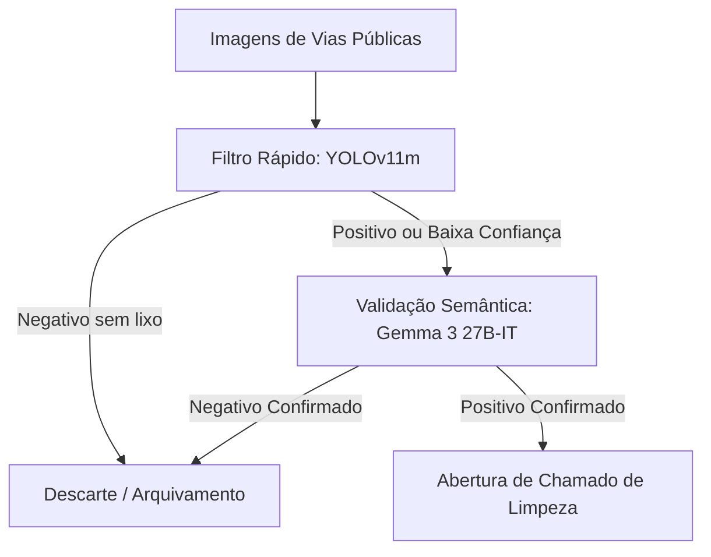

# Viabilidade da Inteligência Artificial no Monitoramento de Resíduos Urbanos em Vias Públicas
### Comparação Experimental entre YOLOv11m e Gemma 3 27B-IT

---

Este repositório contém os dados, códigos e artefatos do Trabalho de Conclusão de Curso (TCC) em Administração pela **Universidade Federal do Ceará (UFC)**. O estudo investiga a viabilidade técnica e gerencial do uso de Inteligência Artificial para identificar o descarte irregular de resíduos em vias públicas brasileiras, comparando dois paradigmas tecnológicos distintos:

1. **YOLOv11m**: Um detector de objetos especializado, ajustado por *fine-tuning* supervisionado.
2. **Gemma 3 27B-IT**: Um modelo visão-linguagem (VLM) de grande porte, avaliado em regime *zero-shot*.

---

## 📊 Matriz Comparativa de Resultados

O experimento foi executado em ambiente controlado utilizando uma GPU **NVIDIA GeForce RTX 5090 (32 GB VRAM)**. A avaliação considerou um conjunto de teste inédito e balanceado contendo **560 imagens reais de ruas brasileiras** (280 positivas com resíduos e 280 negativas).

| Dimensão de Avaliação | Métrica | YOLOv11m (Fine-tuned) | Gemma 3 27B-IT (Zero-shot) | Diferença |
| :--- | :--- | :---: | :---: | :---: |
| **Desempenho Preditivo** | Acurácia | 0,7071 | 0,9179 | **+0,2108** |
| | Precisão | 0,7117 | 0,8611 | **+0,1494** |
| | Sensibilidade (*Recall*) | 0,6964 | 0,9964 | **+0,3000** |
| | Especificidade | 0,7179 | 0,8393 | **+0,1214** |
| | F1-Score | 0,7040 | 0,9238 | **+0,2198** |
| | Taxa de Falsos Positivos | 0,2821 | 0,1607 | **-0,1214** |
| **Consistência Estatística** | Kappa de Cohen | 0,414 | 0,836 | **+0,422** |
| | Coeficiente Matthews (MCC) | 0,414 | 0,846 | **+0,432** |
| **Eficiência Computacional** | Latência Média (Fluxo) | **8,4 ms** | 1.191,3 ms | 141,9x mais rápido |
| | Latência Percentil 95 (P95) | **8,1 ms** | 1.346,9 ms | 166,2x mais rápido |
| | *Throughput* Estimado | **135,2 img/s** | 0,839 img/s | — |

---

## 🔍 Principais Conclusões e Análise Inferencial

* **Significância Estatística**: O teste de **McNemar** rejeitou a hipótese nula de equivalência entre os modelos com significância extrema ($\chi^2 = 74,40$, $p \approx 6,4 \times 10^{-18}$), confirmando que a superioridade preditiva do Gemma 3 nesta tarefa é estatisticamente consistente.
* **Trade-off Operacional**:
  * O **Gemma 3 27B-IT** alcançou sensibilidade quase perfeita ($99,6\%$), minimizando a omissão de áreas com lixo, mas exige alta infraestrutura de processamento (GPU de grande porte).
  * O **YOLOv11m** processou as imagens a uma taxa aproximada de **135 imagens por segundo**, sendo ideal para processamento em tempo real (*edge computing*) ou varreduras volumosas, mas apresentou maior taxa de falsos positivos e subdetecção decorrente de variação no domínio visual urbano brasileiro.

---

## 🛠️ Arquitetura Híbrida Proposta

Os padrões de erros demonstraram complementaridade parcial entre os modelos. Enquanto o YOLOv11m falha em resíduos camuflados ou dispersos, o Gemma 3 ocasionalmente gera falsos alarmes em texturas complexas (como vegetação seca ou calçadas danificadas). 

Propõe-se um fluxo integrado para otimização de recursos municipais:



---

## 📂 Organização do Repositório

```
├── analise_visual_gemma/
│   └── analise_visual.xlsx       # Registro detalhado da inspeção visual do VLM
├── imagens/                      # Diretório reservado para dados locais
├── outputs/
│   ├── figures/                  # Gráficos, matrizes de confusão e curvas de treino
│   ├── metricas_finais.json      # Dados preditivos consolidados
│   ├── resumo_executivo.json     # Metadados consolidados de execução e hardware
│   └── predictions_vlm.json      # Respostas JSON brutas obtidas do Gemma 3
├── requirements.txt              # Dependências Python do projeto
├── .env                          # Variáveis de ambiente (Roboflow, LM Studio API, etc)
└── env.exemplo                   # Arquivo de exemplo contendo a estrutura da configuração
```

---

## 🚀 Como Executar o Projeto

### 1. Configuração do Ambiente
Certifique-se de possuir Python 3.10+ e as dependências do repositório instaladas:
```bash
pip install -r requirements.txt
```

### 2. Variáveis de Ambiente
Copie o arquivo `env.exemplo` para `.env` e preencha as chaves do Roboflow (se for treinar ou obter dados adicionais) e o endpoint do seu servidor do LM Studio:
```bash
cp env.exemplo .env
```

### 3. Execução da Inferência (Gemma 3 27B-IT via LM Studio)
Inicie o servidor local no LM Studio com o modelo `gemma-3-27b-it` (quantização Q5_K_M recomendada) na porta `1234`. 
O prompt padronizado enviado ao modelo é:

> *"Você é um analista de monitoramento de vias públicas. Sua tarefa é responder uma única pergunta: há lixo ou resíduos descartados nesta imagem de rua? Considere como lixo sacos de lixo, garrafas, latas, papelão, embalagens, plásticos, vidros ou qualquer resíduo descartado em via pública ou calçada. Não considere como lixo lixeiras ou contêineres fechados em uso normal, veículos, pessoas, vegetação, mobiliário urbano em bom estado ou pavimentação normal. Responda estritamente em JSON válido, sem markdown e sem texto fora do JSON: `{"tem_lixo": true, "descricao_breve": "...", "confianca": 0.0}`. Caso não haja lixo visível, retorne `"tem_lixo": false`."*

---

## 🎓 Autor e Orientador

* **Autor**: Jaime Teixeira de Araújo Júnior — *Faculdade de Economia, Administração, Atuária e Contabilidade (FEAAC/UFC)* — [jaimetjribeiro@gmail.com](mailto:jaimetjribeiro@gmail.com)
* **Orientador**: Prof. Dr. Carlos de Oliveira Caminha Neto — *Universidade Federal do Ceará (UFC)*
